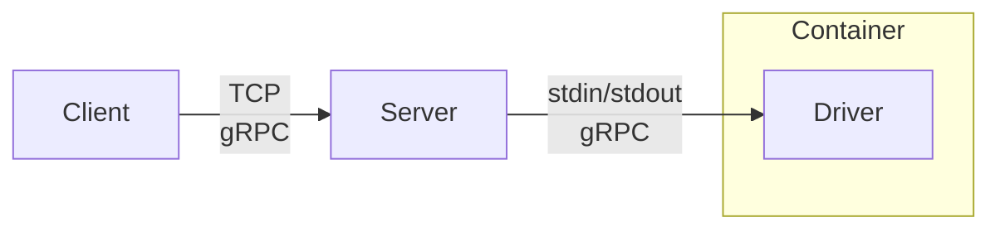
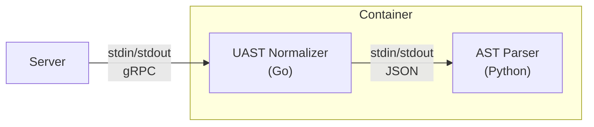

# Architecture

## Overview

Our main building block is the **language driver**, each language driver provides parsing services for one language. It can be written in any language and is packaged as a standard Docker container. These containers are executed by the babelfish **server** in a very specific runtime.

## Language Drivers

A language driver is a Docker container that takes file parsing requests and respond with the AST and the [UAST](./uast/specification.md).

Our implementations of language drivers are composed of two pieces: an AST parser, written in the source language and an AST to UAST normalizer written in Go. In the case of AST parsers written in Go, AST parser and UAST normalizer might be combined in a single executable.

The entry point of the container is the Go UAST normalizer, which wraps the language-specific AST parser. This is how the Python driver looks like:

## Server

The server exposes a parsing interface for every language. It takes requests which it passes to the appropriate language driver. It maintains warm instances of language drivers, pools and handles any other orchestration needs.

### Driver Runtime

The server executes driver in a very constrained and lightweight **driver runtime** based on [libcontainer](https://github.com/opencontainers/runc/tree/master/libcontainer). The runtime executes the driver contained in a standard Docker container in an isolate namespace and cgroup without complex filesystems or networking as docker.

Drivers must assume:

* No network interface.
* Only one core available.

Currently we're allowing drivers to write on disk, although this might be disallowed in the future.
