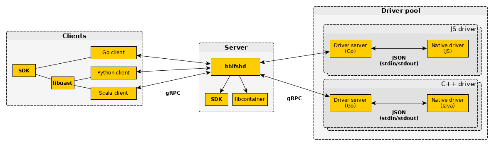

# Architecture

## Overview

Our main building block is the **language driver**, each language driver provides parsing services for one language.
It can be written in any language and is packaged as a standard Docker container. These containers are executed by the **bblfshd** server in a very specific runtime.

## Language Drivers

A language driver is a program, containerized with [Docker](https://www.docker.com/get-docker), that takes file parsing requests with source code and replies with a [UAST](uast/uast-specification-v2.md) representation of the provided source code or an error message.

Our implementations of language drivers are composed of two pieces: a **native driver** (code parser), that can be written in any language \(usually the source language\)
and an **driver server** (AST-to-UAST normalizer) written in Go. In the case of native drivers written in Go or other languages producing linkable object files or shared library,
the native driver and UAST normalizer might be combined by dynamic or static linking without a separate runnable component.

The entry point of the container is the Go driver server, which communicates with the native driver using simple JSON messages via stdin/stdout.

## Daemon

**bblfshd** is the higher level component of the architecture managing client requests \(done via [gRPC](http://www.grpc.io) using [a simple protocol](using-babelfish/babelfish-protocol.md)\) with the containerized language drivers which it orchestrates to keep warm instances, pools and handling any other orchestration needs.

The server itself is also designed to run inside a container allowing an [easy deployment](using-babelfish/getting-started.md#running-with-docker-recommended) and operation.

### Driver Runtime

The server executes driver in a very constrained and lightweight **driver runtime** based on [libcontainer](https://github.com/opencontainers/runc/tree/master/libcontainer).

The runtime executes the driver contained in a standard Docker container in an isolated namespace and cgroup avoiding Docker's complex filesystems or networking features.

Drivers must assume:

* No network interface.
* Only one core available.

Currently we're allowing drivers to write on their container disk, although this might be disallowed in the future.

