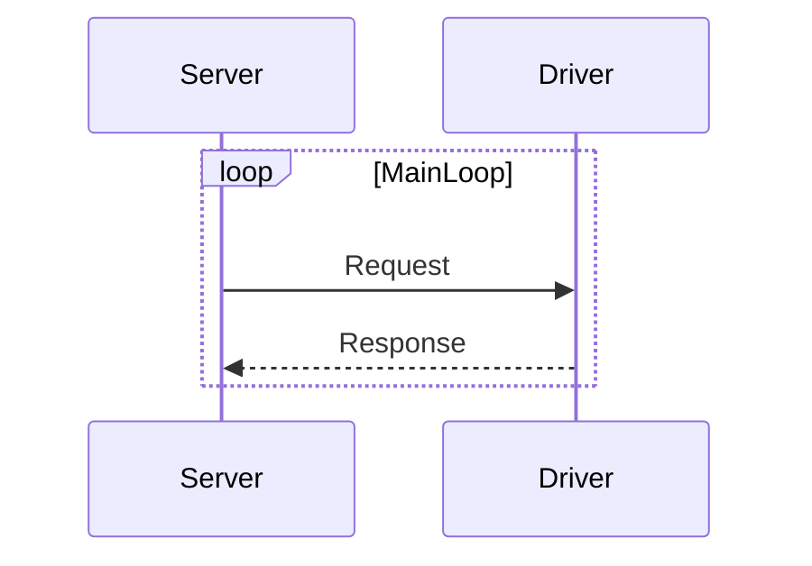

# Driver Protocol

## Transport

Standard input and output is used as transport. This applies both to the
communication between **server and driver** as well as the internal communication
in the driver **UAST converter and AST parser**.

The server can terminate the process cleanly by closing the standard input pipe.
Closing the pipe while there is a pending response not read from standard output
is considered an error, and drivers should return a non-zero exit code. The
client must not perform half-closes (closing standard input if it expects to
continue reading from standard output).

All requests and responses have **sequential order**. Response to request N will
not start until response to request N-1 has finished.

The workflow of the protocol is as follows:



## Encoding

Server-driver communication uses **protobuf 3** for message encoding. In the
driver side, this is implemented in the UAST converter in Go, using the
babelfish SDK.

* **TODO: Add proto**

## Processes

### Info

Info returns information about the driver. There is a general implementation in
the babelfish SDK that uses a [manifest](https://godoc.org/github.com/bblfsh/sdk/manifest#Manifest) to provide this information.

**Request** message has the following structure:

```
{
    "action": "Info"
}
```

**Response** structure is:

* **TODO: Add proto**

### Parse AST

This process **parses a file and returns its AST**. A request contains the content
of the file being analyzed as a string.

It must be implemented by the AST parser.

**Request** message has the following structure:

```
{
    "action": "parse-ast"
    "content": <content> (string)
}
```

**Response** structure is:

```
{
    "status": <status> ("ok", "error", "fatal")
    "errors": [ <error message>, <error message>, ... ]
    "ast": <AST> (object)
}
```

* **TODO: Add proto**

If the parsing is successful, `status` is `ok`. If the file could be parsed
(AST was generated) but had parsing errors, `status` is `error`. If the file
could not be parsed at all (no AST), `status` is `fatal`.

`errors` might contain any parsing errors found. If `status` is `ok`, then
`errors` should be not set.

Note that **binary files are not supported** by this process at the moment. If we
want to add support for [Piet](http://www.dangermouse.net/esoteric/piet.html) in
the future, we will add a binary content field.

Check the [protocol package](https://godoc.org/github.com/bblfsh/sdk/protocol)
godoc for further details.

#### Example

```
[request (pretty printed)]
{
    "action": "parse-ast",
    "content": "#!/bin/bash\nexec foo\n"
}
[response (pretty printed)]
{
    "driver": "bash:1.0",
    "ast": {
        "name": "script",
        "children": [
            { "name": "shebang", "bin": "/bin/bash" },
            { "name": "statement", "bin": "exec",
              "args": [ { "name": "string", "content": "foo" } ]
              }
        ]
    }
}
```

### Parse UAST

Equal to the *parse AST* process, but for UAST. It must be implemented by the
UAST converter.

**Request:**

```
{
    "action": "parse-uast"
    "content": <content> (string)
}
```

**Response** structure is:

```
{
    "status": <status> ("ok", "error", "fatal")
    "errors": [ <error message>, <error message>, ... ]
    "uast": <UAST> (object)
}
```

Check the [protocol package](https://godoc.org/github.com/bblfsh/sdk/protocol)
godoc for further details.

* **TODO: Add proto**
