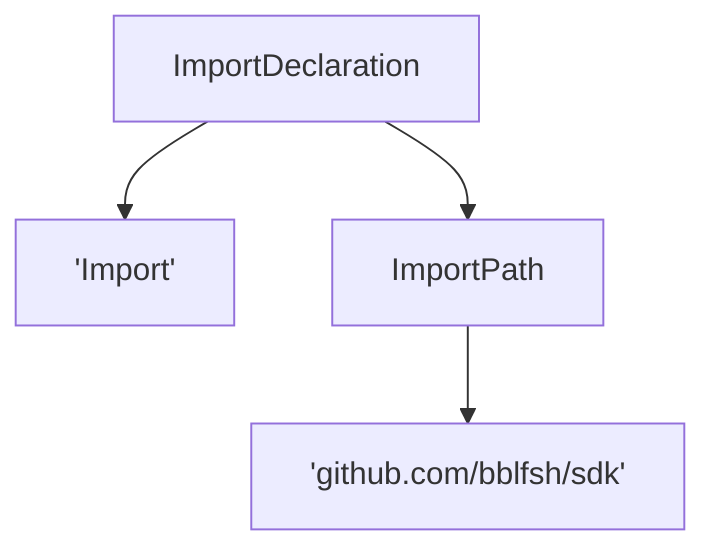

# AST and UAST Specification

## From Code to AST

For each language, we generate a language-specific AST. This AST is as close as
possible to what we get from the standard or common implementation of the AST in
each language.

Drivers MUST guarantee that given the same
`(blob, driver, driver version, language, language version)`, the generated AST
is always the same.

Drivers SHOULD generate an AST without any information loss from the source code.
That is, it should be possible to write a function that given a AST, generates
the same source code that was used to generate that AST, byte by byte.

Most parsers available do not completely prevent information loss during the
conversion. So we currently aim to preserve as much information as possible.
We define different levels of information loss in terms of which kind of code
generation would they allow.

* **Lossless:** Converting code to AST and then back to code would.
  ` code == codegen(AST(code))`.
* **Formatting information loss:** Only superfluous formatting information is lost
  (e.g. whitespace, indentation). Code generated from the AST could be the same
  as the original code after passing a code formatter. `fmt(code) == codegen(AST(code))`.
* **Syntactic sugar information loss:** There is information loss about syntactic
  sugar. Code generated from the AST could be the same as the original code after
  desugaring it. `desugar(code) == codegen(AST(code))`.
* **Comment loss:** Comments are not present in the AST.

Drivers MUST NOT loss data beyond the previous cases.

## From AST to UAST

Universal Abstract Syntax Tree (UAST) is a AST with additional
language-independent annotations.

Since AST to UAST conversion only adds annotations, they can be converted back
to AST by removing such annotations.

## UAST

### Overview

A UAST is a normalized form of AST with language-independent annotations. Its
structure is as follows:

```go
type Node struct {
	InternalType  string
	Properties    map[string]string
	Children      []*Node
	Token         string
	StartPosition Position
	EndPosition   Position
	Roles         []Role
}
```

Check out the godoc for the SDK [UAST package](https://godoc.org/github.com/bblfsh/sdk/uast)
for the full documentation of the UAST structure and annotations.

### Roles

UAST is annotated with **roles**. Roles are language-independent annotations that
describe what nodes in the UAST do.

UAST from different languages have different structures, but role annotations
allow to interpret some aspects uniformly.

For example, let's take an import of a package. If we draw nodes with their role
name and token (those with simple quotes), we might have something as the
following:



Or we might have the following for a different language:

```mermaid
graph TD
    ImportDeclarationToken["'Import'"]
    IQcom["SimpleIdentifier"]
    IQcomToken["'com'"]
    IQgithub["QualifiedIdentifier"]
    IQgithubName["SimpleIdentifier"]
    IQgithubToken["'github'"]
    IQbblfsh["QualifiedIdentifier"]
    IQbblfshName["SimpleIdentifier"]
    IQbblfshToken["'bblfsh'"]
    IQsdk["QualifiedIdentifier"]
    IQsdkName["SimpleIdentifier"]
    IQsdkToken["'sdk'"]

    ImportDeclaration-->ImportDeclarationToken
    ImportDeclaration-->ImportPath

    ImportPath-->IQsdk
    IQsdk-->IQbblfsh
    IQsdk-->IQsdkName
    IQsdkName-->IQsdkToken

    IQbblfsh-->IQgithub
    IQbblfsh-->IQbblfshName
    IQbblfshName-->IQbblfshToken

    IQgithub-->IQcom
    IQgithub-->IQgithubName
    IQgithubName-->IQgithubToken

    IQcom-->IQcomToken
```



One way or the other, we can get the package identifier by retrieving all tokens
under the `ImportPath` role in pre-order.

As it is clear from this example, extracting meaningful information from UAST
requires different tree operations for each role. The documentation and reference
implementation of these operations are defined in the `uast` package of the SDK.