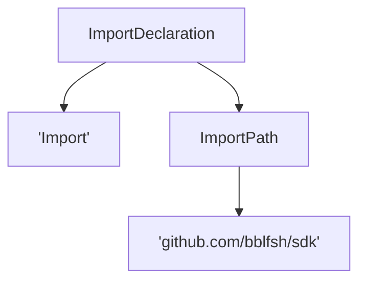
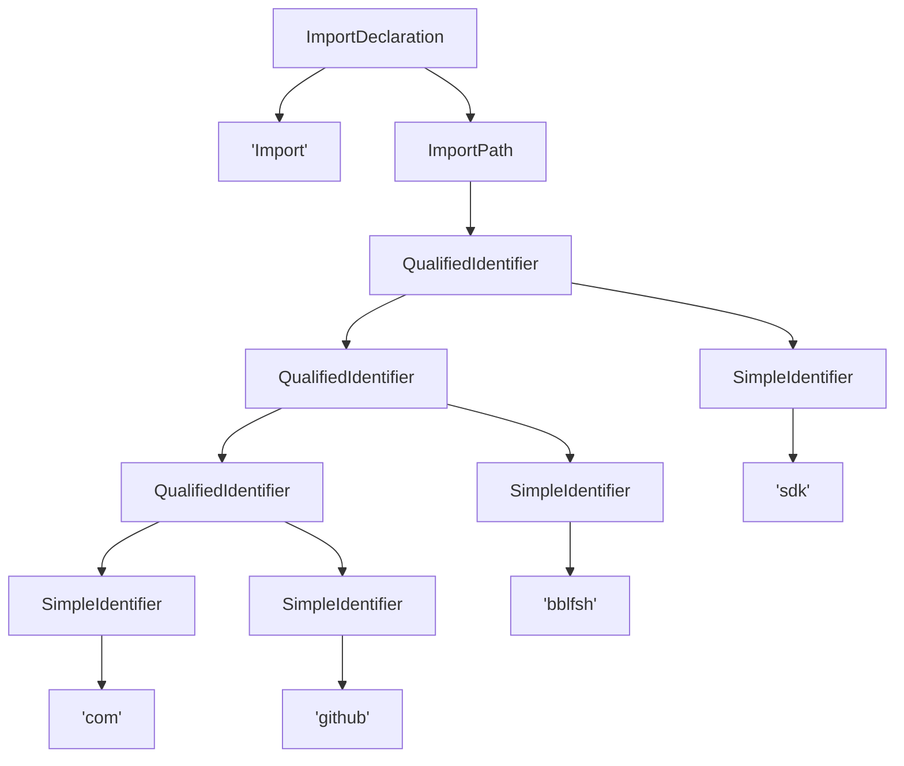

# UAST

## Overview

A UAST is a normalized form of AST with language-independent annotations. Its
structure is as follows:

```go
type Node struct {
	InternalType  string
	Properties    map[string]string
	Children      []*Node
	Token         string
	StartPosition Position
	EndPosition   Position
	Roles         []Role
}
```

**Check out the godoc for the SDK [UAST package](https://godoc.org/github.com/bblfsh/sdk/uast)**
for the full documentation of the UAST structure and annotations.

## Roles

UAST is annotated with **roles**. Roles are language-independent annotations that
describe what nodes in the UAST do. You can check the
[list of all roles in the godoc](http://godoc.org/github.com/bblfsh/sdk/uast/#Role).

UAST from different languages have different structures, but role annotations
allow to interpret some aspects uniformly.

For example, let's take an import of a package. If we draw nodes with their role
name and token (those with simple quotes), we might have something as the
following:



Or we might have the following for a different language:



One way or the other, we can get the package identifier by retrieving all tokens
under the `ImportPath` role in pre-order.

As it is clear from this example, extracting meaningful information from UAST
requires different tree operations for each role. The documentation and reference
implementation of these operations are defined in the
[uast](http://godoc.org/github.com/bblfsh/sdk/uast/)
package of the SDK.

* **TODO:** add more examples