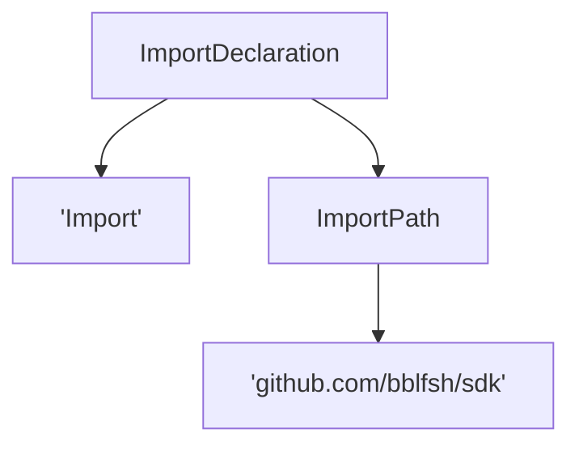
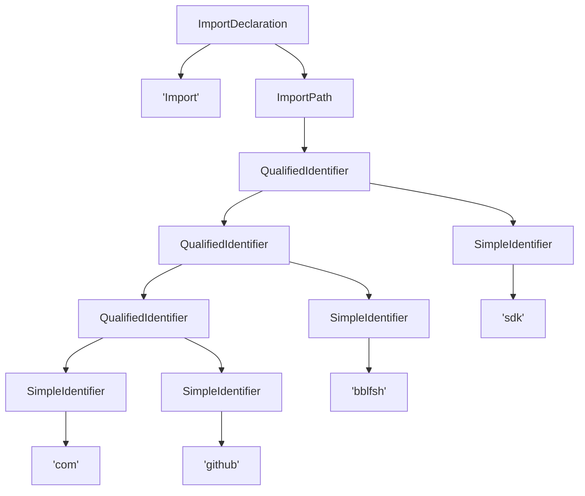

# UAST

## Overview

A UAST is a normalized form of AST with language-independent annotations. Its
structure is as follows:

```go
type Node struct {
	InternalType  string
	Properties    map[string]string
	Children      []*Node
	Token         string
	StartPosition Position
	EndPosition   Position
	Roles         []Role
}
```

**Check out the godoc for the SDK [UAST package](https://godoc.org/github.com/bblfsh/sdk/uast)**
for the full documentation of the UAST structure and annotations.

## Internal Type

The **internal type** is the original node type. It is an arbitrary string and
is language-dependent. For example, in Java it is the class of each node. It is
meant to be used by annotation rules (e.g. *annotate nodes with internal type*
`*ast.File` *with the role* `PackageDeclaration`).

## Properties

**Properties** is a map of language-dependent properties attached to a node. In some
languages, nodes in the AST not only have children, but also other metadata on
each node. That metadata is translated to properties. Properties can be used by
annotation rules too.

## Token

The **token** field contains a token from the original source code. If it is not
an empty string, it means that the node represents a token. In some languages,
all tokens correspond to leaves in the tree, while in other languages, tokens
can be attached to any node.

It is guaranteed that retrieving all tokens from a UAST by doing a pre-order
traversal of the UAST, gives a list of tokens in the same order as in the original
source code. The Go uast package provides the [Tokens](https://godoc.org/github.com/bblfsh/sdk/uast#Tokens)
function to perform this operation.

## Positions

A **position** has the following structure:

```go
type Position struct {
	Offset uint32
	Line   uint32
	Col    uint32
}
```

**Offset** is the absolute byte offset of the position in the original source code.
It is a 0-based index.

**Line** is the line number in the original source code. It is a 1-based index.

**Col** is the column number in the original source code, relative to a line.
It is a 1-based index.

A position `(0, 0, 0)` means that position is not available. Native AST parsers
MUST provide, at least, offset or line+col for positions. The UAST normalization
process includes computing offset from line+col or line+col from offset, in cases
where native AST parser does not provide both. So it is guaranteed that nodes in
a UAST either have no position attached or they have a position with valid
offset, line and col.

There are two possible positions on each node: **start position** and **end position**.
Nodes with defined token SHOULD have, at least, start position, which correspond
to the position of the first character of the token in the original source code.
End position, if present in a token node, is the position of the last character
of the token in the original source code.

Nodes that have no token might have start or end position, indicating the region
of code covered by that node.

* **TODO: define relation with encodings**
* **TODO: disambiguate meaning of start and end position for non-leave nodes with token**

## Roles

UAST is annotated with **roles**. Roles are language-independent annotations that
describe what nodes in the UAST do. You can check the
[list of all roles in the godoc](http://godoc.org/github.com/bblfsh/sdk/uast/#Role).

UAST from different languages have different structures, but role annotations
allow to interpret some aspects independently of the language.

For example, let's take an import of a package. If we draw nodes with their role
name and token (those with simple quotes), we might have something as the
following:



Or we might have the following for a different language:



One way or the other, we can get the package identifier by retrieving all tokens
under the `ImportPath` role in pre-order.

As it is clear from this example, extracting meaningful information from UAST
requires different tree operations for each role. The documentation and reference
implementation of these operations are defined in the
[uast](http://godoc.org/github.com/bblfsh/sdk/uast/)
package of the SDK.

Note that each node can have multiple roles. For example, a node with the
`If` role will also have the `Statement` role for some languages (e.g. Go, Java)
or the `Expression` role for others (e.g. Scala).

* **TODO:** add more examples

## Annotation Rules

Each driver normalized defines a set of **annotation rules**. These rules define
how to add roles to nodes.

For example, in the Java normalizer, `ImportPath` role is added to nodes that
have the internal type `QualifiedName` (Java-specific) with a parent with internal
type `ImportDeclaration` (Java-specific). For a full example, check the
[annotation rules for the Java driver](https://godoc.org/github.com/bblfsh/java-driver/driver/normalizer#pkg-variables).
